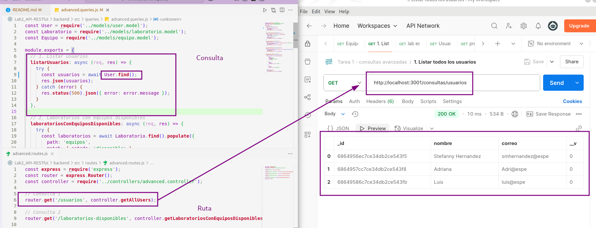
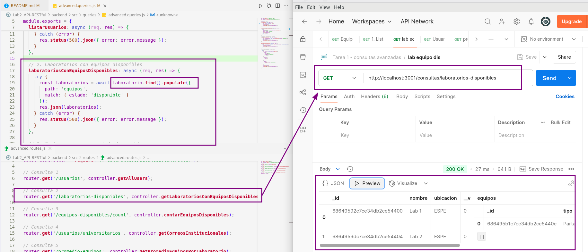
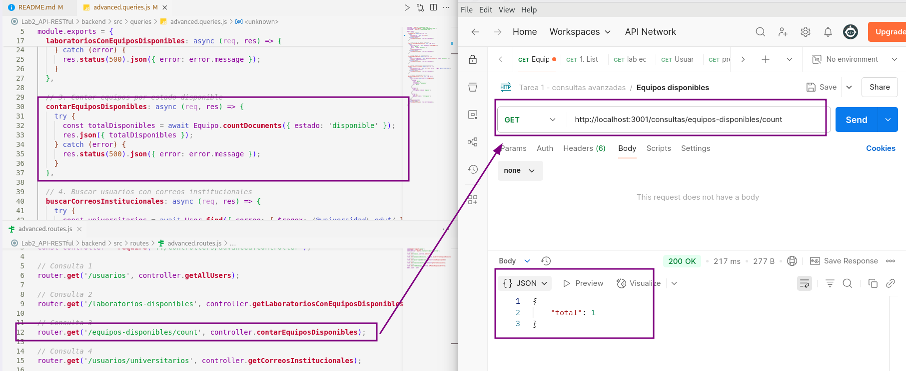
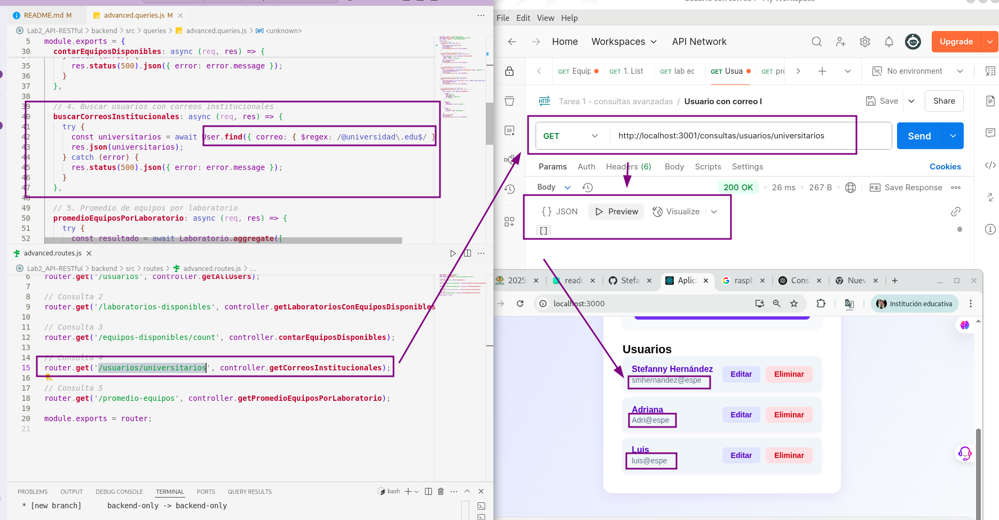
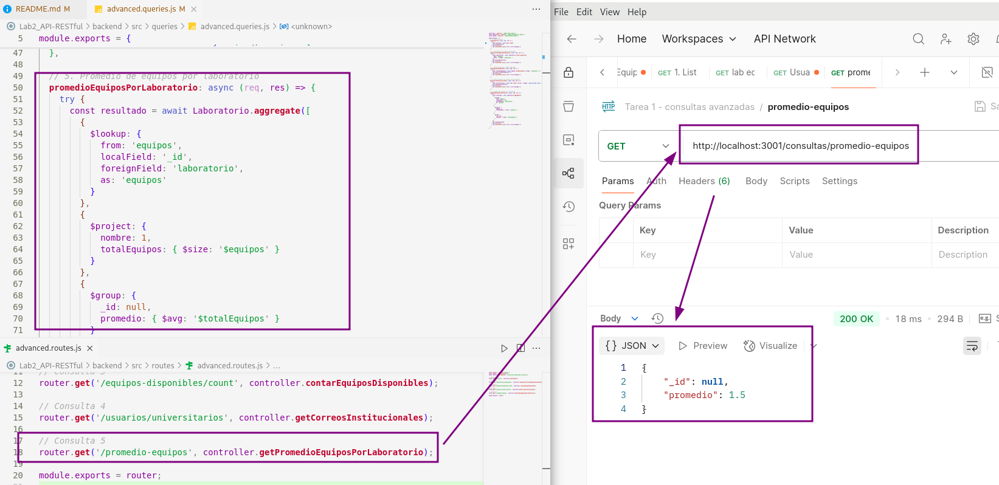

# Práctica: Consultas Avanzadas y Relaciones en MongoDB con Mongoose y Docker

**Nombre:** Stefanny Hernandez  
**Carrera / Curso:** ITIN - Septimo    
**Fecha de entrega:** 1 de julio del 2025


## Introducción

El propósito de esta práctica es desarrollar e implementar consultas avanzadas y relaciones entre colecciones utilizando Mongoose sobre una base de datos MongoDB, integrando contenedores Docker para el entorno de desarrollo. Esto refuerza conceptos de modelado NoSQL, relaciones entre documentos y técnicas de consulta, fundamentales para el desarrollo de aplicaciones modernas.

Las consultas avanzadas y las relaciones en bases de datos NoSQL como MongoDB permiten estructurar y recuperar información compleja de manera eficiente, facilitando la escalabilidad y flexibilidad de las aplicaciones.


## Entorno de Desarrollo

- **Docker Compose** para levantar MongoDB y Mongo Express.
- **Node.js** y **Mongoose** para la lógica de negocio y consultas.
- **Dependencias:**  
  - `mongoose`  
  - `dotenv`  
  - `express`  
  - `cors`  
  - (otras según necesidad)

### Configuración

- El archivo `docker-compose.yml` define los servicios de MongoDB y Mongo Express.
- Variables de entorno gestionadas en `.env` para credenciales y configuración.
- Instalación de dependencias con:
  ```bash
  npm install
  ```


## Modelado de Datos

### Estructura y Relaciones

- **Usuario:**  
  - Campos: nombre, correo, etc.
- **Laboratorio:**  
  - Campos: nombre, ubicación, equipos (relación uno a muchos con Equipo)
- **Equipo:**  
  - Campos: tipo, estado, laboratorio (referencia a Laboratorio)

#### Diagrama de Relaciones

```
Usuario
Laboratorio 1---* Equipo
```

- Un laboratorio puede tener varios equipos (uno a muchos).
- Un equipo pertenece a un laboratorio (referencia por ObjectId).

---

## Desarrollo de Consultas

### Consultas Básicas y Avanzadas

1. **Listar todos los usuarios**
   - Uso de `.find()`
2. **Buscar laboratorios con equipos disponibles**
   - Uso de `.find()` y `.populate()` con filtro `{ estado: 'disponible' }`
3. **Contar cantidad de equipos por estado**
   - Uso de `.countDocuments({ estado: 'disponible' })`
4. **Buscar usuarios cuyo correo termine en @universidad.edu**
   - Uso de `$regex` en el campo correo
5. **Promedio de equipos por laboratorio**
   - Uso de `aggregate` con `$lookup`, `$group`, `$avg`

#### Ejemplo de Código (consultas avanzadas)

```javascript
// Listar usuarios
const usuarios = await User.find();

// Laboratorios con equipos disponibles
const laboratorios = await Laboratorio.find().populate({
  path: 'equipos',
  match: { estado: 'disponible' }
});

// Contar equipos disponibles
const totalDisponibles = await Equipo.countDocuments({ estado: 'disponible' });

// Buscar usuarios con correo institucional
const universitarios = await User.find({ correo: { $regex: /@universidad\.edu$/ } });

// Promedio de equipos por laboratorio
const resultado = await Laboratorio.aggregate([
  { $lookup: { from: 'equipos', localField: '_id', foreignField: 'laboratorio', as: 'equipos' } },
  { $project: { nombre: 1, totalEquipos: { $size: '$equipos' } } },
  { $group: { _id: null, promedio: { $avg: '$totalEquipos' } } }
]);
```

## Relaciones entre Colecciones

- **Referencia directa:**  
  - El modelo Equipo tiene un campo `laboratorio` que es un `ObjectId` referenciando a Laboratorio.
- **Uso de `.populate()`:**  
  - Permite obtener los datos completos del laboratorio al consultar un equipo, y viceversa.


## Endpoints de Consultas Avanzadas


| Consulta                                      | Método | Endpoint                                      | Descripción                                      |
|-----------------------------------------------|--------|-----------------------------------------------|--------------------------------------------------|
| Listar todos los usuarios                     | GET    | /consultas/usuarios                           | Devuelve todos los usuarios                      |
| Laboratorios con equipos disponibles          | GET    | /consultas/laboratorios-disponibles           | Laboratorios con al menos un equipo disponible   |
| Contar equipos disponibles                    | GET    | /consultas/equipos-disponibles/count          | Número total de equipos en estado disponible     |
| Usuarios con correo institucional             | GET    | /consultas/usuarios/universitarios            | Usuarios cuyo correo termina en @universidad.edu |
| Promedio de equipos por laboratorio           | GET    | /consultas/promedio-equipos                   | Promedio de equipos por laboratorio              |


## Instrucciones de Ejecución

### 1. Levantar el entorno con Docker

```bash
sudo docker compose up -d
```

- MongoDB estará disponible en `mongodb://localhost:27018`
- Mongo Express en [http://localhost:8081](http://localhost:8081)

### 2. Instalar dependencias y ejecutar el backend

```bash
npm install
npm start
```

### 3. Probar consultas

- Desde Postman, Insomnia o scripts Node.js.
- Desde Mongo Express para consultas directas.


## Figuras y Gráficos
A continuación, se presentan algunas capturas de pantalla que evidencian el funcionamiento correcto de las consultas avanzadas y relaciones entre colecciones en la base de datos MongoDB, utilizando Mongo Shell y Mongo Express.

Figura 1: Consulta de todos los usuarios (users)



Descripción:
Se muestra el resultado de la consulta db.users.find().pretty(), donde se listan todos los documentos registrados en la colección users. Aquí se visualizan campos como nombre, correo y otros atributos definidos en el modelo de usuario.

Figura 2: Laboratorios con equipos disponibles



Descripción:
Esta captura corresponde a la agregación con $lookup y $filter que permite obtener los laboratorios que tienen equipos con estado "disponible". Se puede observar el campo equiposDisponibles poblado correctamente con los equipos que cumplen esa condición.

Figura 3: Conteo de equipos disponibles



Descripción:
El resultado de db.equipos.countDocuments({ estado: "disponible" }) muestra la cantidad total de equipos disponibles en la base de datos. Esta consulta permite obtener métricas rápidas sobre el estado de los recursos.

Figura 4: Usuarios con correo institucional



Descripción:
La figura muestra el resultado de la búsqueda de usuarios cuyo correo termina en @universidad.edu utilizando el operador $regex. Esto es útil para segmentar usuarios por dominio institucional.

Figura 5: Promedio de equipos por laboratorio



Descripción:
Captura de la agregación que calcula el promedio de equipos por laboratorio. Se utilizan los operadores $lookup, $project y $group para obtener una estadística global de distribución de equipos.


## Conclusiones

Durante la práctica, reforcé el uso de relaciones y consultas avanzadas en MongoDB con Mongoose. Aprendí a modelar colecciones relacionadas y a utilizar agregaciones para obtener información compleja.  
Las principales dificultades fueron la configuración de referencias y el uso correcto de `.populate()`, resueltas revisando la documentación y haciendo pruebas iterativas.


## Referencias

- [Documentación oficial de Mongoose](https://mongoosejs.com/docs/)
- [Documentación oficial de MongoDB](https://www.mongodb.com/docs/)
- [Documentación de Docker](https://docs.docker.com/)
- [Documentación de Mongo Express](https://github.com/mongo-express/mongo-express)

---

**Repositorio:**  
https://github.com/Stefanny26/Lab2_API-RESTful/tree/backend-only